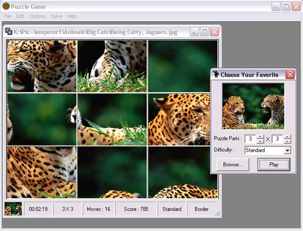



## Puzzle Game

### Description

A simple puzzle game in Visual Basic, you can choose default picture or enter your favorite pictures in run time, puzzle parts are from 2 to 30 for each side (X-Y).

This game contains something about MDI forms, User Controls, Drag and Drop, ADO and API Sounds.

It uses an Access MDB File as database.

----

September.30... Added Difficulty Mode and Solve Menu.
 
### More Info
 

             |
---                |---
**Submitted On**   |2006-10-01 00:51:46
**By**             |[Mohammad Reza Khosravi](https://github.com/Planet-Source-Code/PSCIndex/blob/master/ByAuthor/mohammad-reza-khosravi.md)
**Level**          |Beginner
**User Rating**    |4.8 (38 globes from 8 users)
**Compatibility**  |VB 6\.0
**Category**       |[Games](https://github.com/Planet-Source-Code/PSCIndex/blob/master/ByCategory/games__1-38.md)
**World**          |[Visual Basic](https://github.com/Planet-Source-Code/PSCIndex/blob/master/ByWorld/visual-basic.md)
**Archive File**   |[Puzzle\_Gam2022561012006\.zip](https://github.com/Planet-Source-Code/mohammad-reza-khosravi-puzzle-game__1-66260/archive/master.zip)

